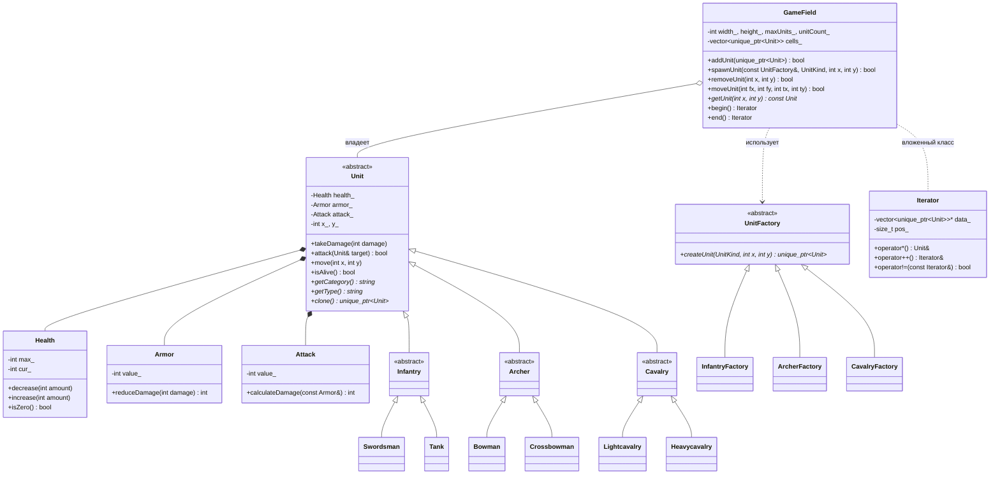

# ЛР 1. Введение в ООП: классы, наследование, фабричный метод, итератор

Курс «ММО РПГ с нуля», 3 семестр. Язык: C++17.

Игровое поле-сетка, на котором стоят юниты трёх типов (по два вида в каждом).
Юниты создаются только через фабрики, поле поддерживает глубокое копирование,
перемещение и обход собственным итератором.

## Сборка и запуск

Из корня проекта:

```bash
mkdir -p build && g++ -std=c++17 -Wall -Wextra -I. $(find . -name "*.cpp") -o build/lab1 && ./build/lab1
```

Программа показывает меню: цифра 1–5 + Enter запускает сценарий, 0 — выход.

## Структура

```
.
├── main.cpp                  меню и 5 демонстрационных сценариев
├── attributes/               классы-атрибуты
│   ├── Health                здоровье (изменяемое, с проверками)
│   ├── Armor                 броня (неизменяемая)
│   └── Attack                атака (неизменяемая)
├── units/                    иерархия юнитов
│   ├── Unit                  абстрактный базовый класс
│   ├── Infantry/             Infantry (абстр.) → Swordsman, Tank
│   ├── Archer/               Archer (абстр.)   → Bowman, Crossbowman
│   └── Cavalry/              Cavalry (абстр.)  → Lightcavalry, Heavycavalry
├── factories/                фабричный метод
│   ├── UnitFactory.h         абстрактная фабрика-создатель + enum UnitKind
│   └── Infantry/Archer/CavalryFactory
└── field/
    └── GameField             поле + вложенный класс GameField::Iterator
```

Каждый класс — пара файлов `.h` / `.cpp`, заголовки защищены `#pragma once`.
У `UnitFactory` только `.h`: все её методы либо `= default`, либо `= 0`, реализовывать нечего.

## Диаграмма классов



`*` — чисто виртуальный метод (`= 0`).

## Атрибуты

`Health`, `Armor`, `Attack` вынесены в отдельные классы, а не хранятся как `int`,
чтобы правила для значений жили в одном месте:

- **Health** — изменяемый, но с инвариантом `0 <= cur <= max`. Менять можно только
  через `decrease` / `increase`: отрицательный аргумент — исключение, урон больше
  здоровья — обрезается до 0, лечение выше максимума — до максимума.
- **Armor**, **Attack** — неизменяемые: значение задаётся в конструкторе, сеттеров нет,
  все методы `const`. Броня гасит фиксированную часть каждого удара и сама не меняется.

Некорректные значения в конструкторах (максимальное здоровье `<= 0`, отрицательные броня
или атака) — исключение `std::invalid_argument`: объект с неверными данными не создаётся.

## Иерархия юнитов

| Уровень | Классы | Что задаёт |
|---|---|---|
| `Unit` (абстрактный) | — | общие данные и поведение: атрибуты, координаты, урон, атака, движение |
| тип (абстрактный) | `Infantry`, `Archer`, `Cavalry` | категорию — `getCategory()` |
| вид (конкретный) | 6 классов | характеристики, `getType()`, `clone()` |

Характеристики:

| Вид | Тип | HP | Броня | Атака |
|---|---|---|---|---|
| Swordsman | Infantry | 100 | 5 | 25 |
| Tank | Infantry | 200 | 50 | 10 |
| Bowman | Archer | 100 | 5 | 30 |
| Crossbowman | Archer | 100 | 10 | 50 |
| Lightcavalry | Cavalry | 200 | 10 | 20 |
| Heavycavalry | Cavalry | 200 | 30 | 30 |

`Unit` содержит атрибуты как поля (композиция, «имеет»), а виды наследуются от типов
(наследование, «является»). Деструктор `Unit` виртуальный: юниты удаляются через
указатель на базовый класс.

## Порождающий паттерн: фабричный метод

`UnitFactory` объявляет фабричный метод `createUnit(UnitKind kind, int x, int y)`,
конкретные фабрики решают, какой класс создать:

| Участник паттерна | В лабе |
|---|---|
| Creator | `UnitFactory` |
| ConcreteCreator | `InfantryFactory`, `ArcherFactory`, `CavalryFactory` |
| Product | `Unit` |
| ConcreteProduct | `Swordsman`, `Tank`, `Bowman`, `Crossbowman`, `Lightcavalry`, `Heavycavalry` |

`enum class UnitKind { Light, Heavy }` выбирает вид внутри типа. Любое значение подходит
любой фабрике, поэтому попросить у пехотной фабрики лучника невозможно в принципе.

### Почему фабричный метод, а не абстрактная фабрика

Абстрактная фабрика нужна, когда создаются **семейства** связанных объектов, которые
должны сочетаться друг с другом (например, «Армия Севера» = северный мечник + северный
лучник + северная конница). В этой лабе семейств нет: есть одна иерархия юнитов, и нужно
лишь спрятать выбор конкретного класса. Для этого достаточно одного фабричного метода,
а абстрактная фабрика дала бы лишние классы без пользы.

Что даёт паттерн:

- `GameField` и `main` не подключают заголовки конкретных юнитов — они знают только
  `UnitFactory` и `UnitKind`. Поле создаёт юнитов через `spawnUnit(factory, kind, x, y)`.
- Конкретные классы подключаются только в `.cpp` своей фабрики.
- Новый вид юнита добавляется новым классом и правкой одной фабрики — поле и остальной
  код не меняются (OCP); код зависит от абстракции `UnitFactory`, а не от конкретных
  классов (DIP).

## Игровое поле `GameField`

Сетка `width x height` хранится одним вектором `std::vector<std::unique_ptr<Unit>>`,
клетка `(x, y)` лежит по индексу `y * width + x`, пустая клетка — `nullptr`.
Поле владеет юнитами: удаляется поле — удаляются его юниты.

Обработка ошибок:

| Ситуация | Реакция |
|---|---|
| координаты вне поля | исключение `std::out_of_range` (ошибка вызывающего кода) |
| клетка занята / достигнут `maxUnits` | `false` (обычная игровая ситуация) |

### Правило пяти

| Метод | Что делает |
|---|---|
| конструктор копирования | **глубокое** копирование: для каждого юнита вызывается `clone()`, копия получает своих юнитов |
| присваивание копированием | copy-and-swap: копия во временный объект, затем перемещение в `*this`; при исключении `*this` не меняется |
| конструктор перемещения | забирает вектор клеток, юниты не копируются; источник остаётся пустым полем `0x0` |
| присваивание перемещением | то же для уже существующего поля; старые юниты удаляются автоматически |
| деструктор | `= default`: `unique_ptr` в каждой клетке сам удаляет юнита |

Копирование нельзя доверить компилятору: `unique_ptr` не копируется, а с обычными
указателями получилось бы поверхностное копирование (два поля на одних и тех же юнитах).
`clone()` — «виртуальный конструктор копирования»: поле видит только `Unit*`, а нужный
тип копии знает сам объект.

## Итератор

`GameField::Iterator` — вложенный класс, обходит **только непустые клетки**.
Хранит указатель на вектор клеток поля и текущую позицию, пустые клетки пропускает сам
(`skipEmpty`). `begin()` — первый юнит, `end()` — позиция за последней клеткой.

- операторы: `*`, `->`, префиксный и постфиксный `++`, `==`, `!=`;
- типы `iterator_category`, `value_type` и др. делают итератор совместимым со STL;
- работает `for (Unit& unit : field)` и стандартные алгоритмы (`std::count_if`);
- конструктор итератора `private`, создаёт итераторы только поле (`friend class GameField`);
- удаление во время обхода безопасно: `removeUnit` не меняет размер вектора, а только
  ставит `nullptr` в клетку. Итератор сдвигается до удаления (`auto current = it++`).

## Демонстрационные сценарии

Каждый сценарий создаёт своё поле, поэтому их можно запускать в любом порядке.

| № | Сценарий | Что показывает |
|---|---|---|
| 1 | создание поля и наполнение через фабрики | `spawnUnit`, занятая клетка, лимит, выход за границы, `moveUnit` |
| 2 | глубокое копирование | копию бьём и удаляем из неё юнита — оригинал не меняется, адреса юнитов разные |
| 3 | перемещение | источник пуст, адрес юнита после перемещения тот же — ничего не скопировано |
| 4 | обход итератором | «дождь стрел» по всем юнитам через range-for, подсчёт живых `std::count_if` |
| 5 | удаление во время обхода | погибшие удаляются прямо в цикле обхода |

## Соответствие критериям оценки

| № | Требование | Баллы | Где |
|---|---|---|---|
| 1 | Основные требования класса поля | 15 | `field/GameField` |
| 2 | Основные требования классов юнитов | 15 | `units/` |
| 3 | Программа разбита на файлы | 5 | `.h` / `.cpp` на каждый класс |
| 4 | Конструкторы копирования и перемещения | 15 | `GameField` — правило пяти, `clone()` у юнитов |
| 5 | Классы для атрибутов | 15 | `attributes/` |
| 6 | Паттерн «Фабричный метод» | 25 | `factories/` |
| 7 | Итератор для поля | 10 | `GameField::Iterator` |
